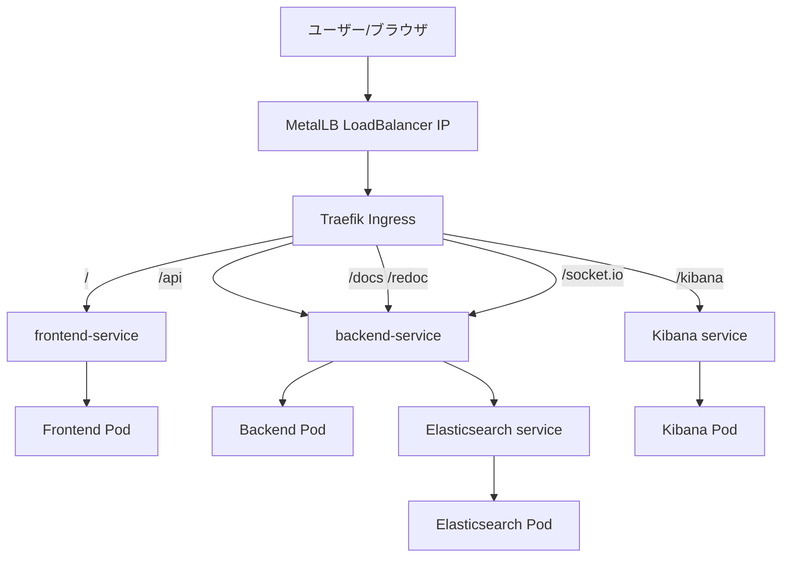

## LogHoihoi 2025-11-11 リリースノート兼実装記録（ブログ下書き）

### 概要
Nutanix ログほいほいついにKubernetes化に対応です
Kubernetes化に合わせて、大きくリファクタリングも行いました
変更点をピックアップです

- **リファクタリング方針（Tidy First）**で基盤整備を優先し、以降の機能追加を速く安全にする
- **バックエンドAPIの変更** Flask から FastAPI へ
- **docker-compose 開発環境を維持**し、日常開発の摩擦を最小化
- **Kubernetes化の実装ポイント**（Dockerfile分離、StorageClass戦略、Recreate戦略、Traefik/MetalLB、ヘルスチェック）
- **認証用SSH鍵の管理方式を統一**（K8sはSecret、composeはホストパス）
- **運用整備：バージョニング、レジストリ移行、ドキュメントの相対パス化、snapshot運用（blog/20251111）**

---

### リファクタリング方針：Tidy First で「掃除してから進む」

- **狙い**: 変更容易性を上げるために、設計負債や運用上のひっかかりを先に解消
- **今回のTidy例**:
  - Ingress のルール整理（`/docs`/`/redoc` の `pathType: Prefix`、不要Middleware/IngressRouteの削除）
  - Dockerfileの用途分離（`dockerfile`=開発、`Dockerfile.k8s`=本番）
  - ストレージとデプロイ戦略の統一（HostPath=Recreate、RWXがない前提を明文化）
  - 依存関係の整合（`aiohttp`をrequirementsへ追加、未使用`httpx`を削除）
  - ドキュメントの相対パス化（複製先でもデプロイ可能に）

ポイントは「小さく安全に片付ける」を繰り返し、機能側の判断をシンプルに保つ

---

### フォルダ構造刷新と汎用コンポーネントの独立

- **背景**: Kubernetes対応で、役割ごとにフォルダを明確に分離
- **scripts/**
  - `k8s/deploy.sh` や `build-and-push.sh` など、環境準備・デプロイを自動化するスクリプト群を集約
  - `init-ssh-keys.sh` や `get-host-ip.sh` のような開発向けユーティリティもここに配置し、再利用性・権限管理を一本化
- **shared/**
  - `shared/gateways/` に Prism API クライアントや Elasticsearch ラッパーなど、バックエンド複数機能で使い回すドメインサービスを格納
  - FastAPIアプリ本体（`backend/fastapi_app`）からは `import shared.gateways...` するだけで利用でき、依存関係が明示的に
  - テストや将来のジョブワーカー追加時にも、同じ shared モジュールを読み込めばロジックを重複させずに済む
- **効果**: コンポーネント間の境界が明確になり、CI/CDやローカル開発の導線も一本化できた

---

### `Swagger` と `ReDoc` の実装（FastAPI標準機能 + Ingress整備）

- **Swagger UIとは**: OpenAPI仕様をGUIで操作できるインタラクティブドキュメントエンドポイントのリクエスト/レスポンス例を見ながら、その場で試し打ちができる
- **ReDocとは**: 同じOpenAPI仕様をもとにした静的ドキュメントビューア情報密度が高く、階層化されたメニューで仕様を読み込みやすい
- **FastAPIでの提供方法**:
  - `app = FastAPI(docs_url="/docs", redoc_url="/redoc", openapi_url="/openapi.json")`
  - エンドポイントやPydanticモデルを定義すると、FastAPIが起動時に**OpenAPIスキーマを自動生成**
- **OpenAPI JSONの所在と内容**:
  - 実体はバックエンドが動的に返す `http://<host>:7776/openapi.json`
  - JSONには `paths`（APIエンドポイント定義）、`components.schemas`（Pydanticモデル）、`securitySchemes` などが含まれ、Swagger/ ReDoc がこれを読み込んで画面表示
  - スナップショットでもコードから生成されるため、専用の静的ファイルを同期する必要がない

---

### docker-compose 開発環境の維持

- **目的**: コンテキストスイッチの少ない日常開発を支援（ホットリロード、手元のElasticsearch/Kibana）
- **要点**
  - `docker-compose.yml` は、ボリュームマウントで `backend/fastapi_app` や `shared` を反映
  - Backend/Frontend は小文字 `dockerfile` を使用（開発専用）
  - `scripts/init-ssh-keys.sh` で初回鍵生成

開発と本番で「ファイル/環境変数/ストレージ/起動方法」が明確に分離され、相互の混入を防止

---

### Kubernetes 化の実装ポイント（現実解の積み上げ）

- **Dockerfile分離**
  - 開発: `backend/dockerfile`, `frontend/dockerfile`, `syslog/dockerfile`
  - 本番: `*/Dockerfile.k8s`
  - 誤運用を防ぎつつ、CI/CDとローカル開発の両立を容易に

- **イメージレジストリ**: GHCR（`ghcr.io/konchangakita/*`）
  - Docker hubに比べて Pull安定性、公開設定で認証レス Pull

- **ストレージ戦略**
  - デフォルトは HostPath `manual`（開発・検証向け）、PVCはRWOのため、Elasticsearch/Backendは **`strategy: Recreate`** を採用
  - 本番用には `STORAGE_CLASS` を環境変数で差し替え（NKP等のCSIに対応）

- **Ingress / ネットワーク**
  - IngressClass: `kommander-traefik`
  - ルーティング: `/api`（API）, `/socket.io`（WebSocket）, `/docs` `/redoc`（API UI）, `/kibana`（UI）, `/`（FE）
  - MetalLB で LoadBalancer IP を割当
  - `/docs` `/redoc` の`pathType: Prefix`化で静的アセットまで確実にバックエンドへ転送し、`/api`付き経路やTraefik Middlewareを整理

- **ヘルスチェック**
  - Backend: `/health`（liveness）, `/ready`（readiness）
  - Frontend/Elastic/Kibana にも適切なProbe

- **自動化スクリプト**
  - `k8s/deploy.sh` が Namespace、Traefik検出/インストール、PV/PVC、各種Manifest、Ingressまでを自動化

---

### 認証用SSH鍵の管理方式（K8s=Secret、compose=ホストパス）

- **共通方針**: 鍵はGit管理せず、ホストディレクトリ `config/.ssh/` に生成・保持
- **Kubernetes**
  - `deploy.sh` が `config/.ssh/` の鍵を検査し、なければ生成→Secret `loghoi-secrets` を作成
  - Deploymentで `/app/config/.ssh` にマウント、`SSH_KEY_PATH`/`SSH_PUBLIC_KEY_PATH` で参照
  - 初回は公開鍵をPrism Element（Cluster Lockdown）へ登録
- **docker-compose**
  - `./config/.ssh` をコンテナにマウント環境変数で鍵パスを指定
  - 初回は `scripts/init-ssh-keys.sh` で鍵生成→公開鍵をUI/ファイルで確認
- **フロント連携**: SSH認証失敗を検知したら、UIで自動的に公開鍵表示を促す

---

### 参考：主要ファイル

- Ingress: `k8s/ingress.yaml`（`/docs`/`/redoc` は `Prefix`）
- デプロイ自動化: `k8s/deploy.sh`
- Backendエントリ: `backend/fastapi_app/app_fastapi.py`（`docs_url`/`redoc_url`）
- 依存関係: `backend/requirements.txt`（`aiohttp` 追加）
- Dockerfile群: `*/dockerfile`（開発用）, `*/Dockerfile.k8s`（本番用）
- 開発Compose: `docker-compose.yml`
- 鍵初期化: `scripts/init-ssh-keys.sh`
- 仕様ドキュメント: `k8s/KUBERNETES_SPEC.md`, `k8s/DEPLOYMENT_GUIDE.md`, `docs/SSH_KEY_MANAGEMENT_SPEC.md`

---

### Ingressルーティング図（Mermaid）

---

### ストレージ比較表

| 環境 | StorageClass | アクセスモード | デプロイ戦略 | 備考 |
|------|--------------|----------------|--------------|------|
| 開発・検証 | `manual` (HostPath) | `ReadWriteOnce` | `Recreate` | ノードローカルに永続化、手軽さ優先 |
| 本番 | `STORAGE_CLASS` 環境変数で指定 (CSI) | クラスタ標準のアクセスモード | `RollingUpdate` (Elasticsearchは環境依存) | NKPなどのクラスタストレージに合わせて差し替え |

---

### 次の改善（アイデア）

- 鍵のローテーション自動化（可能ならPrism API連携）
- 本番向けのReadWriteMany対応ストレージ採用とスケール戦略拡張
- CIでのマニフェスト検証（`kubeval`/`kubectl diff`）とE2Eの最小セット整備
- GitHub Pages 連携で `blog/*` の自動公開

---

以上、記事公開時は図表の追加（Ingressルーティング図、ストレージ比較表、Tidy Firstの前後比較）を行うと伝わりやすくなります

