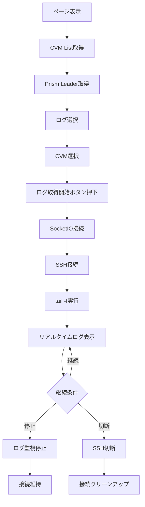
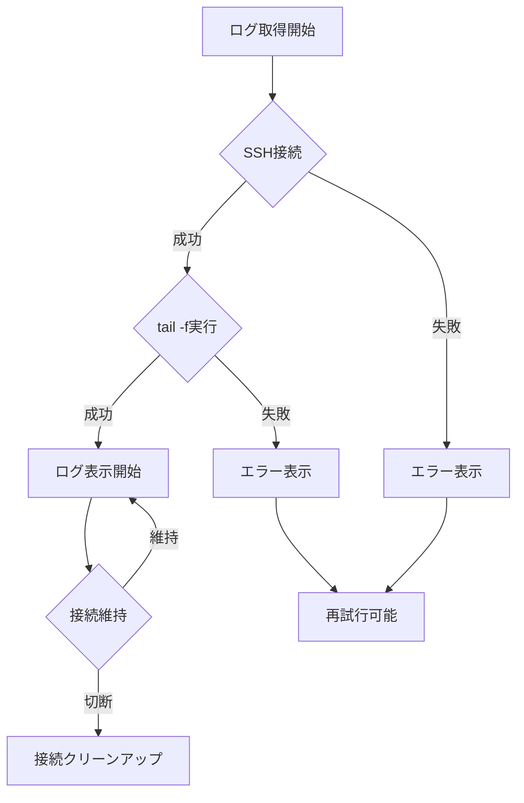

# リアルタイムログ機能 仕様書

## 📋 概要

リアルタイムログ機能は、Nutanix CVMからログファイルをリアルタイムで取得・表示する機能です。ユーザーはログファイルとCVMを選択し、`tail -f`コマンドを使用してリアルタイムでログを監視できます。

## 🎯 基本機能

### 1. ページ初期化

#### 1.1 CVM List取得
- **タイミング**: ページを開いた際に実行
- **データソース**: ElasticsearchからCVM一覧を取得
- **取得内容**: 
  - CVM IPアドレス一覧
  - クラスター情報
  - Prism Leader情報

#### 1.2 Prism Leader取得
- **タイミング**: CVM List取得と同時に実行
- **方法**: SSH接続してPrism Leaderを特定
- **フォールバック**: SSH接続失敗時は最初のCVMをPrism Leaderとして設定

#### 1.3 ログ一覧表示
- **データソース**: 固定のログファイル一覧（`rt-logs.ts`）
- **表示内容**: ログファイル名とパスの一覧
- **選択機能**: ユーザーがログファイルを選択可能

### 2. ログ選択機能

#### 2.1 Log List
- **表示形式**: ラジオボタン形式
- **選択状態**: 選択されたログがハイライト表示
- **スクロール**: 長いリストの場合はスクロール可能

#### 2.2 CVM List
- **表示形式**: ラジオボタン形式
- **デフォルト選択**: Prism Leaderが自動選択
- **選択状態**: 選択されたCVMがハイライト表示

## 🔄 リアルタイムログ取得

### 3. 接続・開始

#### 3.1 手動開始（クリック駆動の順次接続）
- **トリガー**: 「ログ取得開始」ボタンを押下
- **前提条件**: 
  - ログファイルが選択されている
  - CVMが選択されている
- **手順**:
  1) SocketIO接続を開始
  2) SocketIOの`connect`イベントを受信後に`start_tail_f`を送信
  3) バックエンドでSSH接続→`tail -f`開始→ログ配信

#### 3.2 SSH接続
- **接続先**: 選択されたCVM
- **認証方式**: SSH秘密鍵認証
- **鍵ファイル**: `/usr/src/config/.ssh/ntnx-lockdown`
- **タイムアウト**: 10秒

#### 3.3 tail -f実行
- **コマンド**: `tail -f {ログファイルパス}`
- **実行場所**: 選択されたCVM上
- **出力**: リアルタイムでログ行を取得

#### 3.4 リアルタイム配信
- **通信方式**: SocketIO
- **イベント名**: `log`
- **データ形式**: 
  ```json
  {
    "name": "ログファイル名",
    "line": "ログ内容",
    "line_number": 行番号,
    "timestamp": "受信時刻"
  }
  ```

### 4. 表示・操作

#### 4.1 ビュワー表示
- **表示形式**: モックアップコード形式
- **行番号**: 4桁の連番表示
- **ログ名**: `[ログ名]`形式で表示
- **ログ内容**: 実際のログ内容を表示

#### 4.2 継続表示
- **継続条件**: 接続が維持されている限り継続
- **停止条件**: 
  - 手動停止ボタン押下
  - ページ離脱
  - 接続エラー

#### 4.3 自動スクロール
- **動作**: 新しいログが追加されると自動的に最下部にスクロール
- **実装**: `useEffect`でログ配列の変更を監視

## 🛑 停止・切断機能

### 5. 手動停止

#### 5.1 停止ボタン
- **表示条件**: ログ監視中
- **動作**: ログ監視を停止
- **SSH接続**: 維持（再接続可能）

#### 5.2 停止確認
- **モーダル**: 停止確認ダイアログを表示
- **選択肢**: 「STOP」または「キャンセル」

### 6. 自動切断

#### 6.1 ページリロード
- **トリガー**: ブラウザのリロード
- **イベント**: `beforeunload`
- **動作**: SSH接続を即座に切断

#### 6.2 ページ遷移
- **トリガー**: 他のページへの遷移
- **イベント**: `beforeunload`
- **動作**: SSH接続を即座に切断

#### 6.3 ページクローズ
- **トリガー**: ブラウザタブを閉じる
- **イベント**: `beforeunload`, `pagehide`
- **動作**: SSH接続を即座に切断

#### 6.4 画面非表示（無効化済み）
- **トリガー**: タブが非表示になる
- **イベント**: `visibilitychange`（無効化済み）
- **条件**: `document.hidden === true`
- **動作**: SSH接続を維持（自動切断しない）
- **理由**: タブ切替やウィンドウ非アクティブ化での不要な切断を防止

## 🧹 クリーンアップ機能

### 7. ログクリア

#### 7.1 クリアボタン
- **表示**: 常に表示
- **動作**: ビュワーの内容をクリア
- **接続**: 維持（ログ監視は継続）

#### 7.2 状態リセット
- **対象**: 表示中のログ配列
- **保持**: 接続状態、選択状態

### 8. ダウンロード機能

#### 8.1 ダウンロードボタン
- **表示**: 常に表示
- **動作**: ビュワーの内容をダウンロード

#### 8.2 ファイル形式
- **形式**: `.txt`ファイル
- **エンコーディング**: UTF-8
- **ファイル名**: `realtimelog_YYYYMMDD-HHMMSS.txt`

#### 8.3 データ形式
- **形式**: ログ名 + ログ内容
- **区切り**: 改行文字
- **例**:
  ```
  genesis 2025-10-01 15:32:46,665Z INFO 05694432 helper.py:635 Not adding/removing proto-based cerebro firewall rules
  genesis 2025-10-01 15:32:46,671Z INFO 05694432 leadership.py:256 genesis_cluster_manager not prescribed a blueprint for leadership
  ```

## 🔧 技術仕様

### 9. 接続管理

#### 9.1 SocketIO
- **ライブラリ**: `socket.io-client`
- **接続先**: バックエンドのSocketIOサーバー
- **接続設定**:
  - `pingTimeout`: 60000ms（60秒）
  - `pingInterval`: 25000ms（25秒）
  - `timeout`: 20000ms（20秒）
- **イベント**:
  - `connect`: 接続確立
  - `disconnect`: 接続切断
  - `log`: ログ受信
  - `tail_f_status`: 監視状態通知
  - `start_tail_f`: 監視開始
  - `stop_tail_f`: 監視停止

#### 9.2 SSH接続
- **ライブラリ**: Paramiko
- **接続管理**: `ConnectionManager`クラス
- **接続状態**: 接続ID（SID）で管理

#### 9.3 接続状態管理
- **SocketIO接続**: 接続状態を追跡
- **SSH接続**: 接続状態を追跡
- **監視タスク**: 非同期タスクの状態を追跡

### 10. エラーハンドリング

#### 10.1 接続エラー
- **SSH接続失敗**: エラーメッセージを表示
- **SocketIO接続失敗**: エラーメッセージを表示
- **タイムアウト**: 接続タイムアウト時の処理

#### 10.2 ログ取得エラー
- **tail -f失敗**: エラーメッセージを表示
- **権限エラー**: ファイルアクセス権限エラー
- **ファイル不存在**: ログファイルが存在しない場合

#### 10.3 自動再接続
- **実装**: 現在は未実装
- **将来拡張**: 接続断時の自動再接続機能

## 📊 UI/UX仕様

### 11. ボタン状態管理

#### 11.1 接続中状態
- **表示**: 「接続中...」
- **アイコン**: スピナー（ローディング）
- **操作**: 無効化

#### 11.2 未接続状態
- **表示**: 「ログ取得開始」
- **条件**: SocketIO未接続
- **操作**: 接続開始

#### 11.3 接続済み状態
- **表示**: 「ログ取得停止」
- **条件**: SocketIO接続済み、ログ監視中
- **操作**: 監視停止

#### 11.4 ログ未選択状態
- **表示**: 「ログ取得開始 (ログ名未選択)」
- **条件**: ログファイルが選択されていない
- **操作**: 無効化

### 12. ログ表示

#### 12.1 行番号
- **表示**: 4桁の連番（右寄せ）
- **形式**: `   1`, `   2`, `   3`...
- **色**: グレー

#### 12.2 ログ名
- **表示**: `[ログ名]`形式
- **色**: プライマリカラー
- **幅**: 固定幅（80px）

#### 12.3 ログ内容
- **表示**: 実際のログ内容
- **折り返し**: なし（横スクロール）
- **色**: ライトグレー

#### 12.4 タイムスタンプ
- **表示**: ログ受信時刻（オプション）
- **形式**: `YYYY-MM-DD HH:MM:SS`

## 🎯 動作フロー

### 基本フロー



### エラーフロー



## 🔍 デバッグ・ログ

### バックエンドログ

#### 接続ログ
```
SocketIO接続を追加: {SID}
SSH接続を開始: {CVM_IP} (SID: {SID})
SSH接続成功: {CVM_IP} (SID: {SID})
```

#### サーバー設定ログ
```
🚀 Starting LogHoi FastAPI Backend
📊 Elasticsearch: http://elasticsearch:9200
🌐 Server: 0.0.0.0:7776
📖 API Documentation: http://0.0.0.0:7776/docs
```

#### 監視ログ
```
リアルタイム監視を開始: {ログパス} (SID: {SID})
tail -fコマンドを実行: {ログパス} (SID: {SID})
リアルタイムログ [{行番号}]: {ログ内容}
```

#### 切断ログ
```
🔌 SocketIO接続を削除開始: {SID}
🔌 SSH接続のクリーンアップ開始: {SID}
🔌 リアルタイムログ用SSH接続を切断: {SID}
SSH connection close: {SID}
🔌 SocketIO接続を削除完了: {SID}
```

### フロントエンドログ

#### 接続ログ
```
Starting SocketIO connection...
Connected to SocketIO server
SocketIO接続完了。tail -f開始
```

#### 監視ログ
```
Starting tail -f...
receive log: {ログデータ}
tail -f status received: {ステータス}
```

#### 切断ログ
```
Disconnecting SocketIO...
Disconnected from SocketIO server
```

## 📝 実装ファイル

### フロントエンド
- `components/shared/LogViewer.tsx`: メインコンポーネント
- `app/realtimelog/realtimelog-content.tsx`: ページコンテンツ
- `lib/rt-logs.ts`: ログファイル一覧定義

### バックエンド
- `fastapi_app/app_fastapi.py`: メインアプリケーション
- `fastapi_app/connection_manager.py`: 接続管理
- `core/common.py`: SSH接続・CVM取得

## 🚀 今後の拡張予定

### 機能拡張
- [ ] ログフィルタリング機能
- [ ] ログ検索機能
- [ ] 複数ログ同時監視
- [ ] ログアーカイブ機能
- [ ] 自動再接続機能

### パフォーマンス改善
- [ ] ログバッファリング
- [ ] 大量ログ対応
- [ ] メモリ使用量最適化
- [ ] 接続プール管理

### UI/UX改善
- [ ] ダークモード対応
- [ ] レスポンシブデザイン
- [ ] キーボードショートカット
- [ ] ログ表示カスタマイズ

---

**最終更新日**: 2025年10月1日  
**バージョン**: 1.0.0  
**作成者**: LogHoi開発チーム