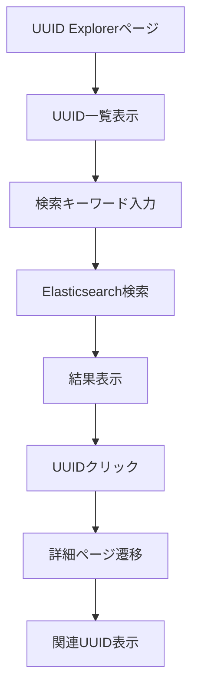

# UUID Explorer 仕様書

## 概要

UUID Explorerは、Nutanixクラスタ内の各種リソース（VM、ストレージコンテナ、ボリュームグループ、vFiler、共有など）のUUID情報を収集・検索・表示する機能です。Elasticsearchをデータストアとして使用し、UUID間の関連性を可視化します。

## 機能概要

### 1. データ収集機能
- **Gatekeeperページ**：UUIDデータ収集のトリガーポイント
- **Prism API連携**：Nutanixクラスタから各種リソース情報を取得
- **Elasticsearch保存**：取得したデータを構造化して保存

### 2. UUID検索・表示機能
- **UUID一覧表示**：各種リソースのUUIDリストを表示
- **UUID検索**：キーワードによるUUID検索
- **関連性表示**：UUID間の関連性を可視化
- **履歴管理**：検索履歴の保存・表示

## アクセスURL

```
http://{FRONTEND_HOST}:7777/uuid?pcip={PC_IP}&cluster={クラスタ名}&prism={クラスタIP}
```

### URLパラメータ
- `pcip`: Prism Central IPアドレス
- `cluster`: クラスタ名
- `prism`: クラスタIPアドレス

### 環境変数
- `FRONTEND_HOST`: フロントエンドサーバーのIPアドレス（例: 10.38.113.49）
- `FRONTEND_PORT`: フロントエンドサーバーのポート番号（固定: 7777）
- `BACKEND_HOST`: バックエンドサーバーのIPアドレス（例: 10.38.113.49）
- `BACKEND_PORT`: バックエンドサーバーのポート番号（固定: 7776）

### データ取得フロー
1. **UUIDエクスプローラページアクセス**: `http://{FRONTEND_HOST}:7777/uuid`にアクセス
2. **SSH鍵認証**: サーバー側で管理されているSSH鍵を使用して認証
3. **データ取得実行**: ページ内の「データ取得」ボタンで実行
4. **Elasticsearch確認**: データがない場合は「現在データ無し」を表示

## 認証方式

### SSH鍵認証
- **認証方法**: SSH鍵認証を使用
- **SSH鍵の場所**: `/home/nutanix/konchangakita/blog-loghoi/ongoing/backend/config/.ssh/ntnx-lockdown`
- **事前設定**: 公開鍵を事前にPrism Element（CVM）へ登録済み
- **認証フロー**:
  1. バックエンドがSSH鍵を使用してCVMに接続
  2. SSH接続成功後、Prism APIで認証
  3. 認証成功後、UUIDデータを取得
- **セキュリティ**: フロントエンドから認証情報を送信する必要がない
- **他の機能との統一**: リアルタイムログとコレクトログと同様の認証方式

## アーキテクチャ

### フロントエンド構成
```
frontend/next-app/loghoi/app/uuid/
├── page.tsx                          # UUID Explorerメインページ
├── layout.tsx                        # UUID Explorerレイアウト
├── [uuid]/page.tsx                   # UUID詳細ページ
├── search/page.tsx                   # UUID検索結果ページ
├── components/
│   ├── UuidHistory.tsx              # UUID検索履歴表示
│   └── UuidListTable.tsx            # UUID一覧テーブル表示
├── hooks/
│   └── useUuidApi.ts                # UUID API呼び出しフック
└── types/
    └── index.ts                      # TypeScript型定義
```

### バックエンド構成
```
backend/fastapi_app/
├── routers/
│   └── uuid.py                       # UUID API実装（SSH鍵認証対応）
├── utils/
│   └── common.py                     # 共通ユーティリティ
└── app_fastapi.py                    # FastAPIアプリケーション

backend/core/
├── ela.py                            # Elasticsearch操作
├── common.py                         # SSH接続機能（connect_ssh）
└── regist.py                         # PC/クラスタ登録

shared/gateways/
├── elastic_gateway.py                # Elasticsearchゲートウェイ
└── regist_gateway.py                 # 登録ゲートウェイ
```

## データフロー

### 1. データ収集フロー
```mermaid
graph TD
    A[UUIDエクスプローラページ] --> B[データ取得ボタンクリック]
    B --> C[Loading表示: 虫アイコン回転]
    C --> D[POST /api/uuid/connect]
    D --> E[SSH鍵でCVM接続（サーバ側管理）]
    E --> F{SSH接続結果}
    F -->|成功| G[Prism API認証]
    F -->|失敗| K[エラーメッセージ表示]
    G --> H{Prism API認証結果]
    H -->|成功| I[プログレスバー表示: UUID collecting...]
    H -->|失敗| K
    I --> J[各種リソース取得]
    J --> L[Elasticsearch保存]
    L --> M[完了通知・ページリロード]
```

### 2. UUID検索フロー


## データ構造

### Elasticsearchインデックス
- `uuid_vms`: VM情報
- `uuid_storage_containers`: ストレージコンテナ情報
- `uuid_volume_groups`: ボリュームグループ情報
- `uuid_vfilers`: vFiler情報
- `uuid_shares`: 共有情報
- `uuid_share_details`: 共有詳細情報
- `search_uuid`: 検索用エイリアス

### データフィールド
```json
{
  "uuid": "リソースUUID",
  "name": "リソース名",
  "timestamp": "収集日時",
  "cluster_name": "クラスタ名",
  "cluster_uuid": "クラスタUUID",
  "metadata": {
    "各種リソース固有のメタデータ"
  }
}
```

## API仕様

### 1. データ収集API
```
POST /api/uuid/connect
```

**リクエストボディ**
```json
{
  "cluster_name": "クラスタ名",
  "prism_ip": "クラスタIP"
}
```

**レスポンス**
```json
{
  "status": "success",
  "message": "UUID data fetched successfully!",
  "data": {
    "cluster_name": "クラスタ名",
    "input_size": {
      "vms": 10,
      "storage_containers": 5,
      "volume_groups": 3,
      "vfilers": 2,
      "shares": 4,
      "share_details": 8
    }
  }
}
```

### 2. UUID検索API
```
GET /api/uuid/search?cluster={クラスタ名}&keyword={検索キーワード}
```

**レスポンス**
```json
{
  "status": "success",
  "data": [
    {
      "_index": "uuid_vms",
      "_source": {
        "uuid": "vm-uuid-123",
        "name": "VM-01",
        "timestamp": "2024-01-01T00:00:00Z",
        "cluster_name": "DC1-PHX-POC339"
      }
    }
  ]
}
```

## 実装状況

### 完了済み
- [x] Gatekeeperページでのデータ収集トリガー
- [x] Elasticsearchデータ保存機能
- [x] UUID履歴管理（Cookie）
- [x] UUID一覧テーブル表示コンポーネント

### 未実装
- [ ] UUID Explorerメインページ
- [ ] UUID検索機能
- [ ] UUID詳細ページ
- [ ] 関連性表示機能
- [ ] バックエンドAPI実装

## 過去実装との関連性

### 参考実装
- **フロントエンド**: `https://github.com/konchangakita/hack23-log-xplorer/tree/main/frontend/next-app/log-xplorer/pages/uuid`
- **バックエンド**: `https://github.com/konchangakita/hack23-log-xplorer/blob/main/backend/flaskr/broker_uuid.py`

### 継承すべき要素
1. **UUID検索ロジック**: 複数フィールドでのマルチマッチ検索
2. **関連性表示**: UUID間の関連性を可視化するUI
3. **履歴管理**: 検索履歴の保存・表示機能
4. **エラーハンドリング**: 検索失敗時の適切なエラー表示

## 技術仕様

### フロントエンド
- **フレームワーク**: Next.js 14
- **UI**: Tailwind CSS + DaisyUI
- **状態管理**: React Hooks
- **Cookie管理**: nookies

### バックエンド
- **フレームワーク**: FastAPI
- **データベース**: Elasticsearch
- **認証**: Prism API認証
- **HTTPクライアント**: requests

### 検索機能
- **検索エンジン**: Elasticsearch
- **検索タイプ**: Multi-match query
- **検索フィールド**: uuid, name, metadata
- **結果制限**: 512件

## セキュリティ考慮事項

1. **認証情報**: Prism認証情報は暗号化して保存
2. **APIアクセス**: 適切な認証・認可の実装
3. **データ保護**: 機密情報の適切なマスキング
4. **入力検証**: 検索キーワードのサニタイズ

## パフォーマンス考慮事項

1. **インデックス最適化**: Elasticsearchインデックスの適切な設定
2. **キャッシュ**: 頻繁にアクセスされるデータのキャッシュ
3. **ページネーション**: 大量データの効率的な表示
4. **非同期処理**: データ収集の非同期化

## データ表示仕様

### データがない場合の表示
- **Elasticsearchにデータがない場合**: 「現在データ無し」メッセージを表示
- **データ取得前**: 初期状態でデータなしメッセージを表示
- **データ取得後**: 取得したデータを表示

### 認証（フロント入力なし）
- **方式**: サーバ側で管理されたSSH鍵による認証（フロントからの資格情報入力は不要）
- **鍵の配置**: `/home/nutanix/konchangakita/blog-loghoi/ongoing/backend/config/.ssh/ntnx-lockdown`
- **前提**: Prism Element（CVM）側に公開鍵を事前登録
- **エラー表示**: 失敗時はページ上にユーザーフレンドリーなメッセージを表示

### Loading・プログレス表示
- **認証中**: Loading画面（虫アイコン回転＋「Loading...」）
- **データ取得中**: プログレスバー（虫アイコン回転＋「UUID collecting...」）
- **プログレス時間**: 30秒間のアニメーション
- **完了後**: 自動的にページリロード

### ナビゲートバー
- **UUID Explorer**: `faFingerprint`（指紋アイコン）- UUIDの一意性を表現
- **Syslog**: `faBarsStaggered`（段階的バーアイコン）- ログの階層構造を表現
- **Realtime log**: `faFileLines`（ファイル行アイコン）+ bounce
- **collect Log**: `faBug`（虫アイコン）+ shake
- **Registration**: `faGear`（歯車アイコン）

## 運用考慮事項

1. **ログ**: 適切なログ出力とモニタリング
2. **エラー処理**: ユーザーフレンドリーなエラーメッセージ
3. **バックアップ**: Elasticsearchデータのバックアップ
4. **監視**: システムヘルスチェック

## 今後の拡張予定

1. **リアルタイム更新**: WebSocketによるリアルタイムデータ更新
2. **可視化**: UUID関連性のグラフ表示
3. **エクスポート**: 検索結果のCSV/JSONエクスポート
4. **フィルタリング**: 高度なフィルタリング機能
5. **API拡張**: RESTful APIの完全実装

## 実装状況

### ✅ 完了項目（v1.0.0）
- **フロントエンド基盤**: UUIDエクスプローラページ構成完了
- **バックエンドAPI**: FastAPI実装完了
- **データ取得機能**: 実際のクラスターからのデータ取得成功
- **Elasticsearch統合**: データ投入・取得機能完了
- **検索機能**: UUID検索・詳細表示機能完了
- **バックエンドURL設定**: `http://{BACKEND_HOST}:7776`でアクセス
- **認証情報入力ダイアログ**: データ取得時のユーザー名・パスワード入力機能
- **データなし表示**: Elasticsearchにデータがない場合の「現在データ無し」表示
- **エラーハンドリング**: 認証失敗・接続エラーの適切な処理と警告表示
- **Loading表示**: 認証処理中のLoading画面（虫アイコン回転＋「Loading...」）
- **プログレスバー**: データ取得中のプログレスバー表示（虫アイコン回転＋「UUID collecting...」）
- **UI/UX改善**: 入力欄の文字色を黒に変更、視認性向上
- **ナビゲートバーアイコン**: UUID Explorer用に`faFingerprint`（指紋アイコン）を採用
- **SSH鍵認証**: パスワード認証からSSH鍵認証方式に変更
- **認証の統一**: リアルタイムログ・コレクトログと同様の認証方式を採用
- **セキュリティ向上**: フロントエンドから認証情報を送信する必要がない

---

**バージョン**: v1.0.0  
**作成日**: 2024年1月  
**最終更新**: 2025年10月4日（SSH鍵認証方式対応）
