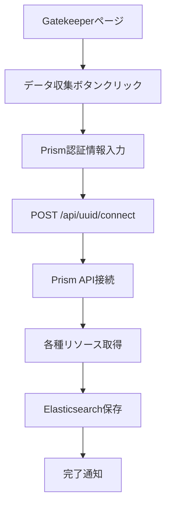
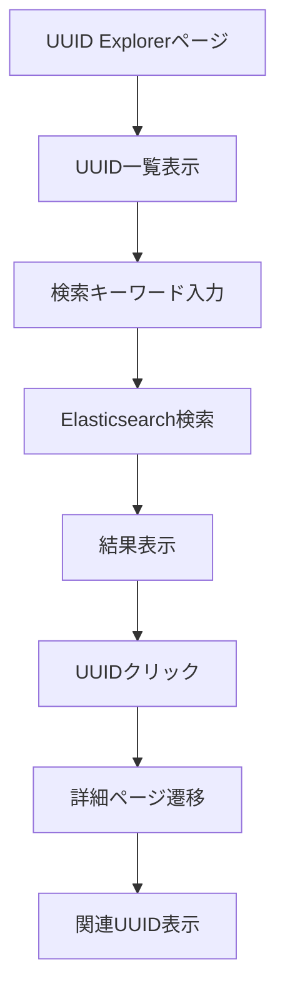

# UUID Explorer 仕様書

## 概要

UUID Explorerは、Nutanixクラスタ内の各種リソース（VM、ストレージコンテナ、ボリュームグループ、vFiler、共有など）のUUID情報を収集・検索・表示する機能です。Elasticsearchをデータストアとして使用し、UUID間の関連性を可視化します。

## 機能概要

### 1. データ収集機能
- **Gatekeeperページ**：UUIDデータ収集のトリガーポイント
- **Prism API連携**：Nutanixクラスタから各種リソース情報を取得
- **Elasticsearch保存**：取得したデータを構造化して保存

### 2. UUID検索・表示機能
- **UUID一覧表示**：各種リソースのUUIDリストを表示
- **UUID検索**：キーワードによるUUID検索
- **関連性表示**：UUID間の関連性を可視化
- **履歴管理**：検索履歴の保存・表示

## アクセスURL

```
http://{FRONTEND_HOST}:{FRONTEND_PORT}/uuid?pcip={PC_IP}&cluster={クラスタ名}&prism={クラスタIP}
```

### URLパラメータ
- `pcip`: Prism Central IPアドレス
- `cluster`: クラスタ名
- `prism`: クラスタIPアドレス

## アーキテクチャ

### フロントエンド構成
```
frontend/next-app/loghoi/
├── app/
│   ├── gatekeeper/
│   │   └── gatekeeper-contents.tsx    # データ収集トリガー
│   └── uuid/                          # UUID Explorerページ（未実装）
├── components/
│   ├── uuidhistory.tsx               # UUID検索履歴表示
│   └── uuidlisttable.tsx             # UUID一覧テーブル表示
└── lib/
    └── setcookie.ts                  # Cookie管理
```

### バックエンド構成
```
backend/
├── core/
│   ├── ela.py                        # Elasticsearch操作
│   └── regist.py                     # PC/クラスタ登録
└── shared/gateways/
    ├── elastic_gateway.py            # Elasticsearchゲートウェイ（重複）
    └── regist_gateway.py             # 登録ゲートウェイ（重複）
```

## データフロー

### 1. データ収集フロー


### 2. UUID検索フロー


## データ構造

### Elasticsearchインデックス
- `uuid_vms`: VM情報
- `uuid_storage_containers`: ストレージコンテナ情報
- `uuid_volume_groups`: ボリュームグループ情報
- `uuid_vfilers`: vFiler情報
- `uuid_shares`: 共有情報
- `uuid_share_details`: 共有詳細情報
- `search_uuid`: 検索用エイリアス

### データフィールド
```json
{
  "uuid": "リソースUUID",
  "name": "リソース名",
  "timestamp": "収集日時",
  "cluster_name": "クラスタ名",
  "cluster_uuid": "クラスタUUID",
  "metadata": {
    "各種リソース固有のメタデータ"
  }
}
```

## API仕様

### 1. データ収集API
```
POST /api/uuid/connect
```

**リクエストボディ**
```json
{
  "cluster_name": "クラスタ名",
  "prism_ip": "クラスタIP",
  "prism_user": "ユーザー名",
  "prism_pass": "パスワード"
}
```

**レスポンス**
```json
{
  "status": "success",
  "message": "UUID data fetched successfully!",
  "data": {
    "cluster_name": "クラスタ名",
    "input_size": {
      "vms": 10,
      "storage_containers": 5,
      "volume_groups": 3,
      "vfilers": 2,
      "shares": 4,
      "share_details": 8
    }
  }
}
```

### 2. UUID検索API
```
GET /api/uuid/search?cluster={クラスタ名}&keyword={検索キーワード}
```

**レスポンス**
```json
{
  "status": "success",
  "data": [
    {
      "_index": "uuid_vms",
      "_source": {
        "uuid": "vm-uuid-123",
        "name": "VM-01",
        "timestamp": "2024-01-01T00:00:00Z",
        "cluster_name": "DC1-PHX-POC339"
      }
    }
  ]
}
```

## 実装状況

### 完了済み
- [x] Gatekeeperページでのデータ収集トリガー
- [x] Elasticsearchデータ保存機能
- [x] UUID履歴管理（Cookie）
- [x] UUID一覧テーブル表示コンポーネント

### 未実装
- [ ] UUID Explorerメインページ
- [ ] UUID検索機能
- [ ] UUID詳細ページ
- [ ] 関連性表示機能
- [ ] バックエンドAPI実装

## 過去実装との関連性

### 参考実装
- **フロントエンド**: `https://github.com/konchangakita/hack23-log-xplorer/tree/main/frontend/next-app/log-xplorer/pages/uuid`
- **バックエンド**: `https://github.com/konchangakita/hack23-log-xplorer/blob/main/backend/flaskr/broker_uuid.py`

### 継承すべき要素
1. **UUID検索ロジック**: 複数フィールドでのマルチマッチ検索
2. **関連性表示**: UUID間の関連性を可視化するUI
3. **履歴管理**: 検索履歴の保存・表示機能
4. **エラーハンドリング**: 検索失敗時の適切なエラー表示

## 技術仕様

### フロントエンド
- **フレームワーク**: Next.js 14
- **UI**: Tailwind CSS + DaisyUI
- **状態管理**: React Hooks
- **Cookie管理**: nookies

### バックエンド
- **フレームワーク**: FastAPI
- **データベース**: Elasticsearch
- **認証**: Prism API認証
- **HTTPクライアント**: requests

### 検索機能
- **検索エンジン**: Elasticsearch
- **検索タイプ**: Multi-match query
- **検索フィールド**: uuid, name, metadata
- **結果制限**: 512件

## セキュリティ考慮事項

1. **認証情報**: Prism認証情報は暗号化して保存
2. **APIアクセス**: 適切な認証・認可の実装
3. **データ保護**: 機密情報の適切なマスキング
4. **入力検証**: 検索キーワードのサニタイズ

## パフォーマンス考慮事項

1. **インデックス最適化**: Elasticsearchインデックスの適切な設定
2. **キャッシュ**: 頻繁にアクセスされるデータのキャッシュ
3. **ページネーション**: 大量データの効率的な表示
4. **非同期処理**: データ収集の非同期化

## 運用考慮事項

1. **ログ**: 適切なログ出力とモニタリング
2. **エラー処理**: ユーザーフレンドリーなエラーメッセージ
3. **バックアップ**: Elasticsearchデータのバックアップ
4. **監視**: システムヘルスチェック

## 今後の拡張予定

1. **リアルタイム更新**: WebSocketによるリアルタイムデータ更新
2. **可視化**: UUID関連性のグラフ表示
3. **エクスポート**: 検索結果のCSV/JSONエクスポート
4. **フィルタリング**: 高度なフィルタリング機能
5. **API拡張**: RESTful APIの完全実装

---

**バージョン**: v1.0.0  
**作成日**: 2024年1月  
**最終更新**: 2024年1月
