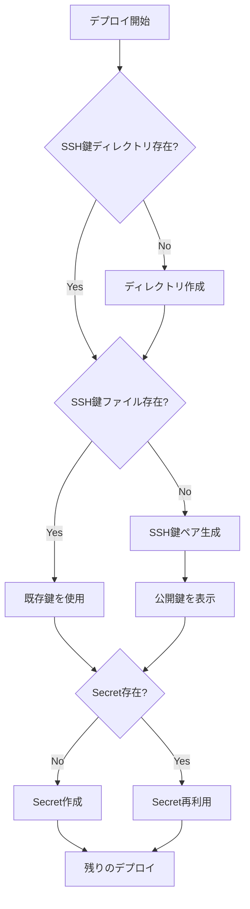
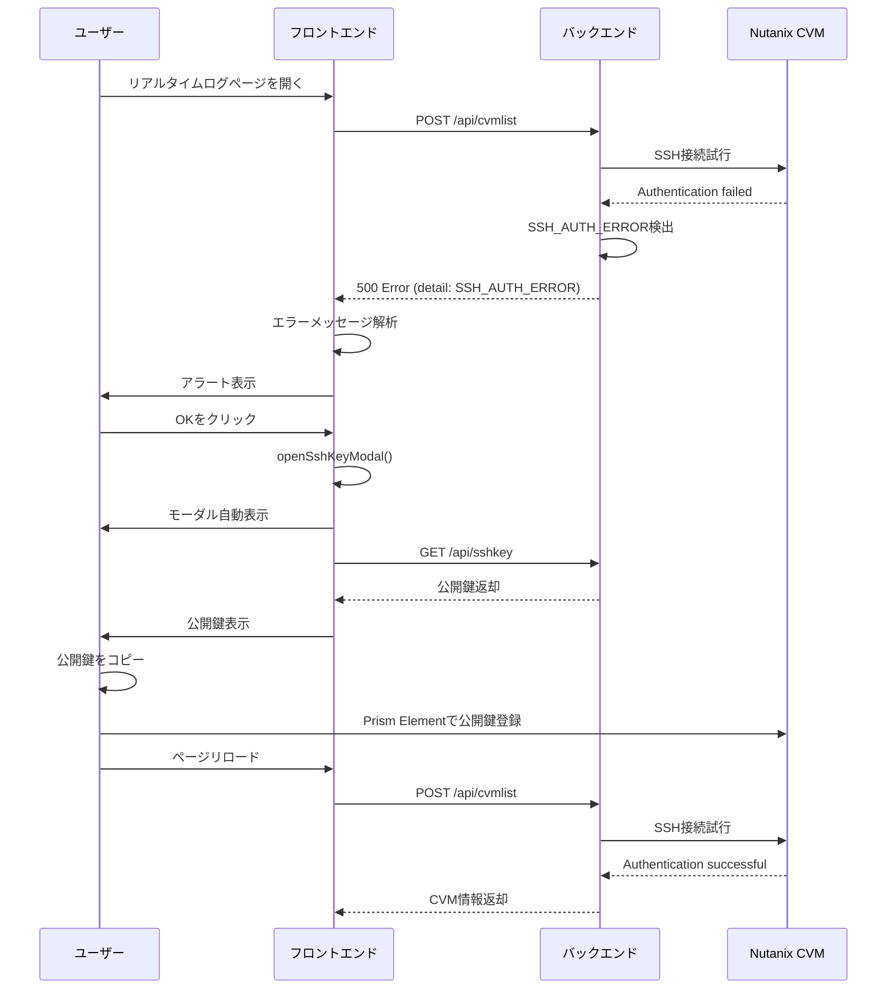

# SSH鍵管理仕様書

## 概要
LogHoiアプリケーションがNutanix CVMに接続するためのSSH鍵を自動生成・管理する仕組みです。Kubernetes本番環境とdocker-compose開発環境の両方に対応します。

## バージョン
1.3.0（最終更新: 2025-10-29）

## 変更履歴
### v1.2.0（2025-10-12）
- 画面上部にAPIErrorメッセージを表示（リアルタイムログ・コレクトログ）
- エラーメッセージのデザインをDaisyUIで統一
- 閉じるボタンを削除（エラーは解決するまで表示）
- コレクトログページでもモーダル自動表示に対応

### v1.1.0（2025-10-12）
- SSH認証エラー時のモーダル自動表示機能を追加
- HTTPエラーレスポンスの詳細取得を改善
- カスタムイベントによるコンポーネント間通信を実装

### v1.0.0（2025-10-12）
- 初版リリース
- SSH鍵自動生成機能の実装
- ホストパス永続化方式の採用
- Kubernetes/docker-compose両環境対応

## システム構成

### SSH鍵の役割
LogHoiは以下の機能でNutanix CVMにSSH接続します：
- **リアルタイムログ収集**: CVMからログをリアルタイム取得
- **ログ収集機能**: CVM内のログファイルを収集
- **hostname取得**: Syslog機能でのCVMホスト名取得

### SSH鍵の永続化方式
**ホストパス永続化方式**を採用：
- 鍵ファイルをホスト（`ongoing/config/.ssh/`）に保存
- Kubernetes: Secretにホストパスから読み込み
- docker-compose: ボリュームマウントで直接参照
- コンテナ再起動しても鍵は保持される

## ディレクトリ構成

```
ongoing/
├── config/
│   └── .ssh/                    # SSH鍵保存ディレクトリ
│       ├── loghoi-key           # 秘密鍵（.gitignore）
│       ├── loghoi-key.pub       # 公開鍵（.gitignore）
│       └── README.md            # 鍵管理の説明
├── k8s/
│   └── deploy.sh                # Kubernetes デプロイスクリプト
├── docker-compose.yml   # docker-compose設定
└── .gitignore                   # 鍵ファイルを除外
```

## SSH鍵生成仕様

### 鍵の仕様
- **アルゴリズム**: RSA
- **鍵長**: 4096ビット
- **パスフレーズ**: なし（自動化のため）
- **コメント**: `loghoi@kubernetes` または `loghoi@docker-compose`
- **ファイル名**: 
  - 秘密鍵: `loghoi-key`
  - 公開鍵: `loghoi-key.pub`

### 生成タイミング
1. **初回デプロイ時**: 鍵が存在しない場合のみ生成
2. **既存鍵がある場合**: 既存の鍵を再利用（再生成しない）
3. **鍵の更新**: 手動で削除してから再デプロイ

### 生成コマンド
```bash
ssh-keygen -t rsa -b 4096 \
  -f /home/nutanix/konchangakita/blog-loghoi/ongoing/config/.ssh/loghoi-key \
  -N "" \
  -C "loghoi@kubernetes"
```

## Kubernetes環境での実装

### 1. deploy.sh の処理フロー

```bash
#!/bin/bash
set -e

# 設定
SSH_KEY_DIR="/home/nutanix/konchangakita/blog-loghoi/ongoing/config/.ssh"
SSH_PRIVATE_KEY="${SSH_KEY_DIR}/loghoi-key"
SSH_PUBLIC_KEY="${SSH_KEY_DIR}/loghoi-key.pub"
NAMESPACE="loghoi"

# 1. SSH鍵ディレクトリの作成
echo "Checking SSH key directory..."
mkdir -p "${SSH_KEY_DIR}"
chmod 700 "${SSH_KEY_DIR}"

# 2. SSH鍵の生成または確認
if [ -f "${SSH_PRIVATE_KEY}" ] && [ -f "${SSH_PUBLIC_KEY}" ]; then
    echo "✓ Existing SSH key pair found"
    echo "  Private key: ${SSH_PRIVATE_KEY}"
    echo "  Public key: ${SSH_PUBLIC_KEY}"
else
    echo "Generating new SSH key pair..."
    ssh-keygen -t rsa -b 4096 \
        -f "${SSH_PRIVATE_KEY}" \
        -N "" \
        -C "loghoi@kubernetes"
    chmod 600 "${SSH_PRIVATE_KEY}"
    chmod 644 "${SSH_PUBLIC_KEY}"
    echo "✓ SSH key pair generated"
fi

# 3. 公開鍵の表示
echo ""
echo "========================================="
echo "📋 SSH公開鍵（Nutanix Prismに登録してください）"
echo "========================================="
cat "${SSH_PUBLIC_KEY}"
echo "========================================="
echo ""
echo "⚠️  この公開鍵をNutanix Prism Elementに登録してください："
echo "   1. Prism Element > Settings > Cluster Lockdown"
echo "   2. 「Add Public Key」をクリック"
echo "   3. 上記の公開鍵を貼り付け"
echo "   4. UIの「Open SSH KEY」ボタンからも確認可能"
echo ""

# 4. Kubernetes Secretの作成
echo "Creating or updating Kubernetes Secret..."
if kubectl --kubeconfig="${KUBECONFIG_PATH}" get secret loghoi-secrets -n ${NAMESPACE} &>/dev/null; then
    echo "✓ Secret 'loghoi-secrets' already exists (keeping it)"
else
    kubectl --kubeconfig="${KUBECONFIG_PATH}" create secret generic loghoi-secrets \
        --namespace=${NAMESPACE} \
        --from-file=SSH_PRIVATE_KEY="${SSH_PRIVATE_KEY}" \
        --from-file=SSH_PUBLIC_KEY="${SSH_PUBLIC_KEY}"
    echo "✓ Secret 'loghoi-secrets' created"
fi

# 5. 残りのデプロイ処理...
```

### 2. backend-deployment.yaml の変更

```yaml
volumes:
- name: ssh-keys
  secret:
    secretName: loghoi-secrets
    items:
    - key: SSH_PRIVATE_KEY
      path: ntnx-lockdown
      mode: 0600
    - key: SSH_PUBLIC_KEY
      path: ntnx-lockdown.pub
      mode: 0644
```

## docker-compose環境での実装

### 1. docker-compose.yml の変更

```yaml
backend:
  volumes:
    - ./config/.ssh:/app/config/.ssh:z  # ホストパスをマウント
  environment:
    - SSH_KEY_PATH=/app/config/.ssh/loghoi-key
    - SSH_PUBLIC_KEY_PATH=/app/config/.ssh/loghoi-key.pub
```

### 2. 起動前の鍵生成スクリプト

**新規ファイル: `scripts/init-ssh-keys.sh`**
```bash
#!/bin/bash

SSH_KEY_DIR="/home/nutanix/konchangakita/blog-loghoi/ongoing/config/.ssh"
SSH_PRIVATE_KEY="${SSH_KEY_DIR}/loghoi-key"
SSH_PUBLIC_KEY="${SSH_KEY_DIR}/loghoi-key.pub"

mkdir -p "${SSH_KEY_DIR}"
chmod 700 "${SSH_KEY_DIR}"

if [ -f "${SSH_PRIVATE_KEY}" ] && [ -f "${SSH_PUBLIC_KEY}" ]; then
    echo "✓ Existing SSH key pair found"
else
    echo "Generating new SSH key pair for docker-compose environment..."
    ssh-keygen -t rsa -b 4096 \
        -f "${SSH_PRIVATE_KEY}" \
        -N "" \
        -C "loghoi@docker-compose"
    chmod 600 "${SSH_PRIVATE_KEY}"
    chmod 644 "${SSH_PUBLIC_KEY}"
    
    echo ""
    echo "========================================="
    echo "📋 SSH公開鍵（Nutanix Prismに登録してください）"
    echo "========================================="
    cat "${SSH_PUBLIC_KEY}"
    echo "========================================="
    echo "⚠️  UIの「Open SSH KEY」ボタンからも確認可能"
fi
```

### 3. docker-compose起動前の手順

```bash
# 鍵生成（初回のみ）
./scripts/init-ssh-keys.sh

# docker-compose起動
docker-compose -f docker-compose.yml up -d
```

## エラーハンドリング

### SSH接続失敗時のエラーメッセージ

**バックエンド（`backend/core/common.py`）**:
```python
def connect_ssh(cvm_ip: str):
    try:
        # SSH接続処理
        ...
    except paramiko.ssh_exception.AuthenticationException as e:
        error_msg = (
            f"❌ SSH認証エラー: {cvm_ip}\n"
            f"原因: SSH公開鍵がNutanixに登録されていない可能性があります\n"
            f"対処方法:\n"
            f"  1. UIの「Open SSH KEY」ボタンをクリック\n"
            f"  2. 表示された公開鍵をコピー\n"
            f"  3. Prism Element > Settings > Cluster Lockdown\n"
            f"  4. 「Add Public Key」で公開鍵を登録\n"
            f"公開鍵パス: /app/config/.ssh/loghoi-key.pub"
        )
        print(error_msg)
        raise Exception(error_msg)
```

**フロントエンド（エラー表示）**:
```tsx
// SSH認証エラーの場合
if (error.includes("SSH認証エラー")) {
  return (
    <div className="alert alert-error">
      <div>
        <h3 className="font-bold">SSH認証エラー</h3>
        <p>Nutanix CVMへのSSH接続に失敗しました</p>
        <div className="mt-2">
          <p className="text-sm">対処方法:</p>
          <ol className="list-decimal list-inside text-sm ml-2">
            <li>画面右上の「Open SSH KEY」ボタンをクリック</li>
            <li>表示された公開鍵をコピー</li>
            <li>Prism Element → Settings → Cluster Lockdown</li>
            <li>「Add Public Key」で公開鍵を登録</li>
          </ol>
        </div>
      </div>
    </div>
  )
}
```

## セキュリティ考慮事項

### .gitignore設定
```gitignore
# SSH Keys
ongoing/config/.ssh/loghoi-key
ongoing/config/.ssh/loghoi-key.pub
ongoing/config/.ssh/*.pem
ongoing/config/.ssh/id_*
```

### ファイルパーミッション
- **秘密鍵**: `600` (所有者のみ読み書き)
- **公開鍵**: `644` (全員読み取り可、所有者のみ書き込み)
- **ディレクトリ**: `700` (所有者のみアクセス)

### 鍵のローテーション
```bash
# 既存鍵を削除
rm -f /home/nutanix/konchangakita/blog-loghoi/ongoing/config/.ssh/loghoi-key*

# Kubernetes Secret削除
kubectl delete secret loghoi-secrets -n loghoi

# docker-compose再起動 or deploy.sh再実行
# → 新しい鍵が生成される
```

## 運用手順

### 初回デプロイ（新環境）
1. `deploy.sh` 実行 → SSH鍵自動生成
2. コンソールに表示される公開鍵をコピー
3. Nutanix Prism Elementに公開鍵を登録
4. アプリケーション動作確認

### 既存環境の更新
1. 既存鍵が残っている → そのまま使用
2. デプロイ実行 → 鍵の再生成なし
3. Nutanix側の鍵も変更不要

### トラブルシューティング

#### SSH接続エラーが発生した場合
1. **エラーメッセージ確認**:
   ```
   ❌ SSH認証エラー: 10.55.23.41
   原因: SSH公開鍵がNutanixに登録されていない可能性があります
   ```

2. **公開鍵の確認**:
   ```bash
   # ファイルから確認
   cat /home/nutanix/konchangakita/blog-loghoi/ongoing/config/.ssh/loghoi-key.pub
   
   # UIから確認
   「Open SSH KEY」ボタンをクリック
   ```

3. **Nutanix Prismで登録**:
   - Prism Element > Settings > Cluster Lockdown
   - 「Add Public Key」をクリック
   - 公開鍵を貼り付けて保存

4. **接続テスト**:
   ```bash
   # CVMに直接SSH接続してテスト
   ssh -i /home/nutanix/konchangakita/blog-loghoi/ongoing/config/.ssh/loghoi-key \
       nutanix@<CVM_IP>
   ```

#### 鍵を再生成したい場合
1. 既存鍵を削除:
   ```bash
   rm -f /home/nutanix/konchangakita/blog-loghoi/ongoing/config/.ssh/loghoi-key*
   ```

2. Kubernetes Secretを削除（Kubernetes環境の場合）:
   ```bash
   kubectl delete secret loghoi-secrets -n loghoi
   ```

3. 再デプロイ:
   ```bash
   # Kubernetes
   cd /home/nutanix/konchangakita/blog-loghoi/ongoing/k8s
   ./deploy.sh
   
   # docker-compose
   cd /home/nutanix/konchangakita/blog-loghoi/ongoing
   ./scripts/init-ssh-keys.sh
   docker-compose -f docker-compose.yml restart backend
   ```

4. 新しい公開鍵をNutanix Prismに登録

## 詳細仕様

### 1. Kubernetes環境

#### 1.1 deploy.sh の処理フロー



#### 1.2 deploy.sh の実装

```bash
#!/bin/bash
set -e

# 設定
SSH_KEY_DIR="/home/nutanix/konchangakita/blog-loghoi/ongoing/config/.ssh"
SSH_PRIVATE_KEY="${SSH_KEY_DIR}/loghoi-key"
SSH_PUBLIC_KEY="${SSH_KEY_DIR}/loghoi-key.pub"
NAMESPACE="loghoi"
KUBECONFIG_PATH="${KUBECONFIG:-/home/nutanix/nkp/kon-hoihoi.conf}"

echo "======================================"
echo "   SSH Key Management"
echo "======================================"
echo ""

# SSH鍵ディレクトリの作成
if [ ! -d "${SSH_KEY_DIR}" ]; then
    echo "Creating SSH key directory..."
    mkdir -p "${SSH_KEY_DIR}"
    chmod 700 "${SSH_KEY_DIR}"
    echo "✓ Directory created: ${SSH_KEY_DIR}"
fi

# SSH鍵の生成または確認
if [ -f "${SSH_PRIVATE_KEY}" ] && [ -f "${SSH_PUBLIC_KEY}" ]; then
    echo "✓ Existing SSH key pair found"
    echo "  Private key: ${SSH_PRIVATE_KEY}"
    echo "  Public key: ${SSH_PUBLIC_KEY}"
    KEYS_GENERATED=false
else
    echo "Generating new SSH key pair..."
    ssh-keygen -t rsa -b 4096 \
        -f "${SSH_PRIVATE_KEY}" \
        -N "" \
        -C "loghoi@kubernetes"
    
    chmod 600 "${SSH_PRIVATE_KEY}"
    chmod 644 "${SSH_PUBLIC_KEY}"
    echo "✓ SSH key pair generated successfully"
    KEYS_GENERATED=true
fi

# 公開鍵の表示（新規生成時または既存鍵）
echo ""
echo "========================================="
echo "📋 SSH公開鍵"
echo "========================================="
cat "${SSH_PUBLIC_KEY}"
echo "========================================="
echo ""

if [ "$KEYS_GENERATED" = true ]; then
    echo "🔑 新しいSSH鍵が生成されました"
    echo ""
    echo "⚠️  必須作業: Nutanix Prismへの公開鍵登録"
    echo "   1. Prism Element > Settings > Cluster Lockdown"
    echo "   2. 「Add Public Key」をクリック"
    echo "   3. 上記の公開鍵を貼り付けて保存"
    echo ""
    echo "💡 ヒント:"
    echo "   - アプリUIの「Open SSH KEY」ボタンからも確認可能"
    echo "   - クリックでクリップボードにコピーされます"
    echo ""
    read -p "公開鍵の登録は完了しましたか？ (y/N): " -n 1 -r
    echo ""
    if [[ ! $REPLY =~ ^[Yy]$ ]]; then
        echo "デプロイを中断します。公開鍵を登録してから再実行してください。"
        exit 1
    fi
else
    echo "ℹ️  既存のSSH鍵を使用します"
    echo "   公開鍵がNutanix Prismに登録済みか確認してください"
fi

# Kubernetes Secretの作成または更新
echo ""
echo "Creating Kubernetes Secret..."
K="kubectl --kubeconfig=${KUBECONFIG_PATH}"

if ${K} get secret loghoi-secrets -n ${NAMESPACE} &>/dev/null; then
    echo "✓ Secret 'loghoi-secrets' already exists"
else
    ${K} create secret generic loghoi-secrets \
        --namespace=${NAMESPACE} \
        --from-file=SSH_PRIVATE_KEY="${SSH_PRIVATE_KEY}" \
        --from-file=SSH_PUBLIC_KEY="${SSH_PUBLIC_KEY}"
    echo "✓ Secret 'loghoi-secrets' created"
fi

# ... 残りのデプロイ処理 ...
```

### 1.3 backend-deployment.yaml の変更

```yaml
apiVersion: apps/v1
kind: Deployment
metadata:
  name: loghoi-backend
spec:
  template:
    spec:
      volumes:
      - name: ssh-keys
        secret:
          secretName: loghoi-secrets
          items:
          - key: SSH_PRIVATE_KEY
            path: ntnx-lockdown
            mode: 0600
          - key: SSH_PUBLIC_KEY
            path: ntnx-lockdown.pub
            mode: 0644
      
      containers:
      - name: backend
        volumeMounts:
        - name: ssh-keys
          mountPath: /app/config/.ssh
          readOnly: true
        env:
        - name: SSH_KEY_PATH
          value: "/app/config/.ssh/ntnx-lockdown"
        - name: SSH_PUBLIC_KEY_PATH
          value: "/app/config/.ssh/ntnx-lockdown.pub"
```

## docker-compose環境での実装

### 2.1 init-ssh-keys.sh の実装

**新規ファイル: `scripts/init-ssh-keys.sh`**
```bash
#!/bin/bash
set -e

SSH_KEY_DIR="/home/nutanix/konchangakita/blog-loghoi/ongoing/config/.ssh"
SSH_PRIVATE_KEY="${SSH_KEY_DIR}/loghoi-key"
SSH_PUBLIC_KEY="${SSH_KEY_DIR}/loghoi-key.pub"

echo "======================================"
echo "   SSH Key Initialization"
echo "======================================"
echo ""

mkdir -p "${SSH_KEY_DIR}"
chmod 700 "${SSH_KEY_DIR}"

if [ -f "${SSH_PRIVATE_KEY}" ] && [ -f "${SSH_PUBLIC_KEY}" ]; then
    echo "✓ Existing SSH key pair found"
    echo "  ${SSH_PRIVATE_KEY}"
    echo "  ${SSH_PUBLIC_KEY}"
else
    echo "Generating new SSH key pair..."
    ssh-keygen -t rsa -b 4096 \
        -f "${SSH_PRIVATE_KEY}" \
        -N "" \
        -C "loghoi@docker-compose"
    
    chmod 600 "${SSH_PRIVATE_KEY}"
    chmod 644 "${SSH_PUBLIC_KEY}"
    
    echo ""
    echo "✓ SSH key pair generated"
    echo ""
    echo "========================================="
    echo "📋 SSH公開鍵（Nutanix Prismに登録してください）"
    echo "========================================="
    cat "${SSH_PUBLIC_KEY}"
    echo "========================================="
    echo ""
    echo "⚠️  この公開鍵をNutanix Prism Elementに登録してください："
    echo "   1. Prism Element > Settings > Cluster Lockdown"
    echo "   2. 「Add Public Key」をクリック"
    echo "   3. 上記の公開鍵を貼り付け"
    echo ""
    echo "💡 アプリ起動後、UIの「Open SSH KEY」ボタンからも確認可能"
fi

echo ""
echo "✓ SSH keys ready for docker-compose"
```

### 2.2 docker-compose_fastapi.yml の変更

```yaml
services:
  backend:
    volumes:
      - ./config/.ssh:/app/config/.ssh:z
    environment:
      - SSH_KEY_PATH=/app/config/.ssh/loghoi-key
      - SSH_PUBLIC_KEY_PATH=/app/config/.ssh/loghoi-key.pub
```

### 2.3 起動手順

```bash
# 1. SSH鍵の初期化（初回のみ）
cd /home/nutanix/konchangakita/blog-loghoi/ongoing
./scripts/init-ssh-keys.sh

# 2. docker-compose起動
docker-compose -f docker-compose.yml up -d

# 3. 公開鍵の確認（必要に応じて）
cat /home/nutanix/konchangakita/blog-loghoi/ongoing/config/.ssh/loghoi-key.pub
```

## バックエンド実装

### regist_gateway.py の変更

```python
def get_sshkey(self):
    """SSH公開鍵を取得（環境変数対応）"""
    # 環境変数から公開鍵パスを取得
    file_path = os.getenv(
        "SSH_PUBLIC_KEY_PATH", 
        "/app/config/.ssh/loghoi-key.pub"
    )
    
    try:
        with open(file_path, "r") as file:
            content = file.read()
        return content
    except FileNotFoundError:
        error_msg = (
            f"SSH公開鍵が見つかりません: {file_path}\n"
            f"デプロイスクリプトを実行してSSH鍵を生成してください。"
        )
        print(f"❌ {error_msg}")
        return json.dumps({"error": error_msg})
    except Exception as e:
        return json.dumps({"error": str(e)})
```

### common.py の変更

```python
def connect_ssh(cvm_ip: str, username: str = "nutanix"):
    """SSH接続を確立（詳細なエラーメッセージ付き）"""
    key_file = os.getenv("SSH_KEY_PATH", "/app/config/.ssh/loghoi-key")
    
    try:
        client = paramiko.SSHClient()
        client.set_missing_host_key_policy(paramiko.AutoAddPolicy())
        
        private_key = paramiko.RSAKey.from_private_key_file(key_file)
        client.connect(
            hostname=cvm_ip,
            username=username,
            pkey=private_key,
            timeout=10
        )
        
        return client
        
    except FileNotFoundError:
        error_msg = (
            f"❌ SSH秘密鍵が見つかりません: {key_file}\n"
            f"デプロイスクリプトを実行してSSH鍵を生成してください。"
        )
        print(error_msg)
        raise Exception(error_msg)
        
    except paramiko.ssh_exception.AuthenticationException as e:
        error_msg = (
            f"❌ SSH認証エラー: {cvm_ip}\n"
            f"原因: SSH公開鍵がNutanix Prismに登録されていない可能性があります\n"
            f"\n"
            f"対処方法:\n"
            f"  1. UIの「Open SSH KEY」ボタンをクリック\n"
            f"  2. 表示された公開鍵をコピー\n"
            f"  3. Prism Element > Settings > Cluster Lockdown\n"
            f"  4. 「Add Public Key」で公開鍵を登録\n"
            f"\n"
            f"公開鍵ファイル: {key_file}.pub"
        )
        print(error_msg)
        raise Exception(error_msg)
        
    except Exception as e:
        error_msg = f"❌ SSH接続エラー: {cvm_ip} - {str(e)}"
        print(error_msg)
        raise Exception(error_msg)
```

## .gitignore 設定

```gitignore
# SSH Keys（機密情報）
ongoing/config/.ssh/loghoi-key
ongoing/config/.ssh/loghoi-key.pub
ongoing/config/.ssh/*.pem
ongoing/config/.ssh/id_*
ongoing/config/.ssh/known_hosts

# SSH鍵ディレクトリは保持、中身は除外
!ongoing/config/.ssh/README.md
```

## README.md の追加

**新規ファイル: `ongoing/config/.ssh/README.md`**
```markdown
# SSH Keys Directory

このディレクトリにはLogHoiがNutanix CVMに接続するためのSSH鍵が保存されます。

## ファイル
- `loghoi-key`: SSH秘密鍵（自動生成、Gitには含めない）
- `loghoi-key.pub`: SSH公開鍵（自動生成、Gitには含めない）

## 鍵の生成方法

### Kubernetes環境
```bash
cd /home/nutanix/konchangakita/blog-loghoi/ongoing/k8s
./deploy.sh
```

### docker-compose環境
```bash
cd /home/nutanix/konchangakita/blog-loghoi/ongoing
./scripts/init-ssh-keys.sh
```

## Nutanix Prismへの登録

1. 公開鍵を確認:
   ```bash
   cat loghoi-key.pub
   ```

2. Prism Element > Settings > Cluster Lockdown

3. 「Add Public Key」で公開鍵を登録

## トラブルシューティング

### SSH接続エラーが発生した場合
- 公開鍵がNutanix Prismに登録されているか確認
- UIの「Open SSH KEY」ボタンで公開鍵を確認・コピー

### 鍵を再生成したい場合
```bash
rm -f loghoi-key*
# 再度デプロイスクリプトを実行
```
```

## 環境変数

### Kubernetes環境
```yaml
# backend-deployment.yaml
env:
- name: SSH_KEY_PATH
  value: "/app/config/.ssh/loghoi-key"
- name: SSH_PUBLIC_KEY_PATH
  value: "/app/config/.ssh/loghoi-key.pub"
```

### docker-compose環境
```yaml
# docker-compose_fastapi.yml
environment:
  - SSH_KEY_PATH=/app/config/.ssh/loghoi-key
  - SSH_PUBLIC_KEY_PATH=/app/config/.ssh/loghoi-key.pub
```

## SSH認証エラー時の自動対応機能

### 概要
SSH鍵認証エラーが発生した場合、ユーザーに対して自動的にSSH公開鍵を表示し、Nutanix Prismへの登録を促す機能です。

### エラー検出
以下のエラータイプを自動検出します：

| エラータイプ | 検出キーワード | バックエンドログ |
|---|---|---|
| **SSH鍵認証失敗** | `SSH_AUTH_ERROR` | `Authentication (publickey) failed.` |
| **SSH鍵認証失敗** | `SSH公開鍵` | `SSH公開鍵がNutanix Prismに登録されていない` |
| **SSH鍵ファイル不在** | `SSH秘密鍵が見つかりません` | `FileNotFoundError: SSH秘密鍵が見つかりません` |

### 動作フロー



### 技術実装

#### 1. カスタムイベントシステム

**ファイル**: `frontend/next-app/loghoi/lib/sshKeyModal.ts`

```typescript
// SSH Keyモーダルを外部から制御するためのイベント管理
export const SSH_KEY_MODAL_EVENT = 'open-ssh-key-modal'

export const openSshKeyModal = () => {
  const event = new CustomEvent(SSH_KEY_MODAL_EVENT)
  window.dispatchEvent(event)
}
```

#### 2. Navbarでイベントリッスン

**ファイル**: `frontend/next-app/loghoi/components/navbar.tsx`

```typescript
// 外部からモーダルを開くイベントをリッスン
useEffect(() => {
  const handleOpenModal = () => {
    setIsOpen(true)  // モーダルを開く
  }
  
  window.addEventListener(SSH_KEY_MODAL_EVENT, handleOpenModal)
  
  return () => {
    window.removeEventListener(SSH_KEY_MODAL_EVENT, handleOpenModal)
  }
}, [])
```

#### 3. エラー発生時にモーダル起動

**ファイル**: `frontend/next-app/loghoi/app/realtimelog/realtimelog-content.tsx`

```typescript
// エラーステートの追加
const [apiError, setApiError] = useState<string | null>(null)

.then(async (res) => {
  if (!res.ok) {
    // エラーレスポンスのボディを取得
    const errorData = await res.json().catch(() => ({}))
    const errorDetail = errorData.detail || `HTTP error! status: ${res.status}`
    throw new Error(errorDetail)
  }
  return res.json()
})
.catch((error) => {
  const errorMsg = error.message || error.toString()
  
  // エラーメッセージを画面上部に表示
  setApiError(errorMsg)
  
  // SSH鍵認証エラーまたはSSH鍵ファイル不在の場合
  if (errorMsg.includes('SSH_AUTH_ERROR') || 
      errorMsg.includes('SSH公開鍵') || 
      errorMsg.includes('SSH秘密鍵が見つかりません')) {
    alert(
      '🚨 SSH接続が失敗しています！\n\n' +
      'ssh key を Prism Element の Cluster Lockdown で設定してください。\n\n' +
      'SSH公開鍵を表示します。'
    )
    // モーダルを自動表示
    openSshKeyModal()
  } else {
    alert('CVM情報の取得に失敗しました: ' + errorMsg)
  }
})
```

#### 4. エラーメッセージUI表示

**ファイル**: `frontend/next-app/loghoi/app/realtimelog/realtimelog-content.tsx`

```tsx
return (
  <>
    {isLoading && <Loading />}
    {apiError && (
      <div className="alert alert-error mb-4">
        <span>APIError: {apiError}</span>
      </div>
    )}
    {/* メインコンテンツ */}
  </>
)
```

**ファイル**: `frontend/next-app/loghoi/app/collectlog/collectlog-content.tsx`

```tsx
// SSH認証エラーの監視
useEffect(() => {
  if (error) {
    const errorMsg = error.message || ''
    console.log('Error detected:', errorMsg)
    
    if (errorMsg.includes('SSH_AUTH_ERROR') || 
        errorMsg.includes('SSH公開鍵') || 
        errorMsg.includes('SSH秘密鍵が見つかりません')) {
      alert(
        '🚨 SSH接続が失敗しています！\n\n' +
        'ssh key を Prism Element の Cluster Lockdown で設定してください。\n\n' +
        'SSH公開鍵を表示します。'
      )
      openSshKeyModal()
    }
  }
}, [error])

return (
  <>
    {!!error && (
      <div className="alert alert-error mb-4">
        <span>APIError: {String(error)}</span>
      </div>
    )}
    {/* メインコンテンツ */}
  </>
)
```

**デザイン仕様**:
- DaisyUI `alert alert-error`クラスを使用
- 赤色の背景で警告を強調
- 閉じるボタンなし（エラーは解決するまで表示）
- 両ページで完全に統一されたデザイン

### API仕様

#### GET /api/sshkey

SSH公開鍵を取得するAPI

**リクエスト**
```http
GET /api/sshkey HTTP/1.1
Host: localhost:7776
```

**レスポンス（成功）**
```json
{
  "status": "success",
  "data": {
    "public_key": "ssh-rsa AAAAB3NzaC1yc2EAAAADAQABAAACAQ... loghoi@docker-compose"
  }
}
```

**レスポンス（エラー）**
```json
{
  "status": "error",
  "message": "SSH公開鍵ファイルが見つかりません: /app/config/.ssh/loghoi-key.pub"
}
```

### エラーハンドリング

#### バックエンド（common.py）

```python
def connect_ssh(hostname):
    """SSH接続を確立（詳細なエラーメッセージ付き）"""
    username = "nutanix"
    key_file = os.getenv("SSH_KEY_PATH", "/app/config/.ssh/loghoi-key")
    
    try:
        rsa_key = paramiko.RSAKey.from_private_key_file(key_file)
    except FileNotFoundError:
        error_msg = (
            f"❌ SSH秘密鍵が見つかりません: {key_file}\n"
            f"デプロイスクリプトを実行してSSH鍵を生成してください。"
        )
        print(error_msg)
        return False
    
    try:
        client.connect(hostname=hostname, username=username, pkey=rsa_key, timeout=10)
    except paramiko.ssh_exception.AuthenticationException:
        error_msg = (
            f"❌ SSH認証エラー: {hostname}\n"
            f"原因: SSH公開鍵がNutanix Prismに登録されていない可能性があります"
        )
        print(error_msg)
        return False
```

#### フロントエンド - HTTPエラーレスポンスの取得

**リアルタイムログページ（realtimelog-content.tsx）**:

```typescript
.then(async (res) => {
  if (!res.ok) {
    // エラーレスポンスのボディを取得
    const errorData = await res.json().catch(() => ({}))
    const errorDetail = errorData.detail || `HTTP error! status: ${res.status}`
    throw new Error(errorDetail)
  }
  return res.json()
})
```

**コレクトログページ（useApiError.ts）**:

```typescript
const executeApiCall = useCallback(async (
  apiCall: () => Promise<Response>,
  operation: string,
  context?: Record<string, any>
): Promise<T | null> => {
  try {
    const response = await apiCall()
    
    if (!response.ok) {
      // エラーレスポンスのボディを取得
      const errorData = await response.json().catch(() => ({}))
      const errorDetail = errorData.detail || `HTTP error! status: ${response.status}`
      
      const error = new APIError(
        errorDetail,  // ✅ detailを使用
        response.status,
        'HTTP_ERROR',
        undefined,
        operation
      )
      handleError(error, { operation, responseStatus: response.status, ...context })
      return null
    }
    // ...
  }
}, [handleError, clearError, handleApiResponse, handleFetchError])
```

### トラブルシューティング

#### モーダルが表示されない場合

1. **ブラウザコンソールを確認**
   ```javascript
   // エラーメッセージを確認
   console.error('CVM API error:', error)
   ```

2. **エラーメッセージに`SSH_AUTH_ERROR`が含まれているか確認**
   - 含まれていない場合、バックエンドのエラーメッセージを確認

3. **カスタムイベントが発火しているか確認**
   ```javascript
   // ブラウザコンソールで確認
   window.addEventListener('open-ssh-key-modal', () => {
     console.log('Modal event received!')
   })
   ```

#### 公開鍵が表示されない場合

1. **`/api/sshkey`エンドポイントを確認**
   ```bash
   curl http://localhost:7776/api/sshkey
   ```

2. **SSH公開鍵ファイルの存在確認**
   ```bash
   ls -la ongoing/config/.ssh/loghoi-key.pub
   ```

3. **環境変数の確認**
   ```bash
   # コンテナ内で確認
   docker exec loghoi-backend env | grep SSH
   ```

## セキュリティベストプラクティス

### DO（推奨）
- ✅ 秘密鍵のパーミッションを600に設定
- ✅ SSH鍵をGitリポジトリに含めない
- ✅ 環境ごとに異なる鍵を使用（可能な場合）
- ✅ 定期的な鍵のローテーション
- ✅ 不要になった鍵は即座に削除

### DON'T（禁止）
- ❌ 秘密鍵をGitにコミットしない
- ❌ 秘密鍵をSlack/メールで共有しない
- ❌ パーミッションを緩くしない（600以外）
- ❌ パスフレーズなしの鍵を本番で使用しない（現在は自動化のため許容）

## 将来の改善案

### 1. パスフレーズ付き鍵のサポート
- 環境変数でパスフレーズを管理
- より高いセキュリティレベル

### 2. 鍵のローテーション自動化
- 定期的な鍵の再生成
- Nutanix APIでの自動登録（可能な場合）

### 3. 複数環境対応
- 開発/ステージング/本番で異なる鍵
- 環境別のディレクトリ分離

### 4. 監査ログ
- 鍵の生成・削除履歴
- SSH接続履歴の記録

